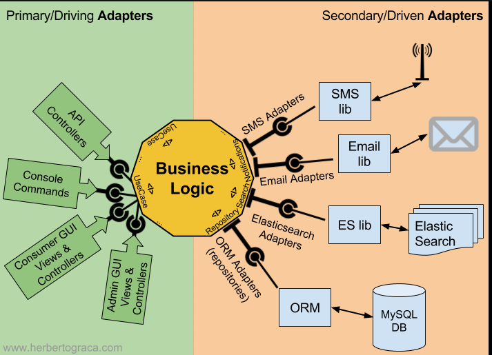

Projeto com pratica utilizando Arquitetura Hexagonal, futuramente será convertido em outras stack, apenas como treino.

Linguagem utilizada: Node.js com Express.js com typescript, Jest

Projeto será invoce e conversão de moeda utilizaremos o dolar, inicialmente!

